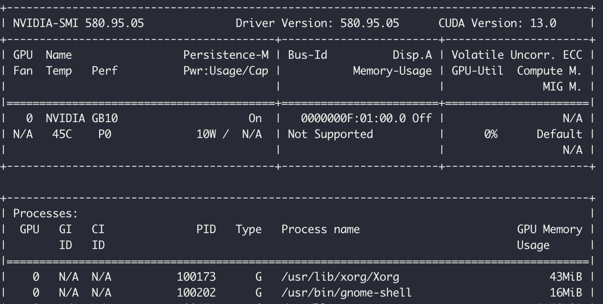
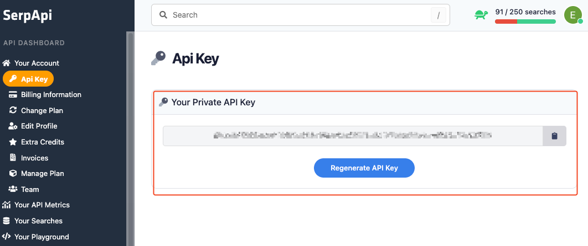
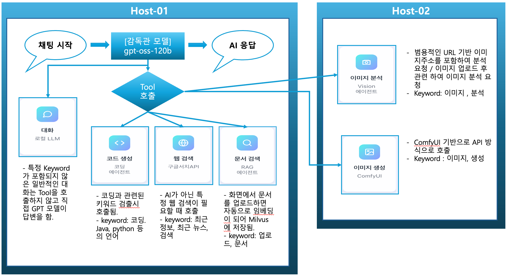

# 멀티에이전트 챗봇 시스템

## 💫 프로젝트 개요

**2대의 서버** 위에서 실행되는 **멀티 에이전트 시스템**입니다.
실제 [엔비디아에서 제공하는 예제](https://build.nvidia.com/spark/multi-agent-chatbot)는 120G에서 동작 시키기에 부족함이 있습니다.
대형 모델이 3개가 올라가고 여러 기능 테스트를 하다보면 순식간에 120G까지 메모리가 사용되어 시스템 대시보드에 접속이 안되는 현상도 발생이 됩니다.
그렇게 때문에 제대로 테스트를 하기 위해 2대의 GB10 을 사용하여 멀티 에이전트 시스템을 구성했습니다.

2개의 머신에서 사용될 수 있는 최대 통합메모리는 240G 입니다. 이 메모리를 적절히 잘 사용하기 위해서 기본 기능 외에 3가지 기능을 더 추가 한 버전입니다.
기본적으로 중심에는 **Supervisor(감독) 에이전트**가 있으며, 이 에이전트는 문맥에 따라 코드 작성, 문서 임베딩 검색 , LLM 호출, 이미지 분석 , 이미지 생성 , 웹 검색을 호출하여 고객에게 다양한 정보를 제공합니다.

---

## 💫 사전 설치 대상
**[1] nvidia driver 이상 여부 체크**

> **nvidia-smi 명령**
  >>기본적으로 자체 OS에 설치가 되어 있습니다. 아래와 같이 나오면 정상.
  만약 나오지 않는다면 제대로 드라이버가 설치 되지 않았기 드라이버 설치를 하거나 OS 재설치를 권장합니다.
> 


> 
**[2] Docker 설치**

**기본적으로 docker는 설치가 되어 있지 않기 때문에 설치를 해야함.**
1️⃣ 준비 — 오래된 Docker 흔적 제거
  - 혹시 남아 있을 수도 있는 오래된 버전들을 먼저 정리합니다:
~~~
  sudo apt-get remove -y docker docker-engine docker.io containerd runc
~~~
2️⃣ 필수 패키지 설치
  - HTTPS 리포지토리를 추가하기 위한 유틸리티를 설치합니다:
~~~
sudo apt-get updatesudo apt-get install -y ca-certificates curl gnupg lsb-release
~~~
3️⃣ Docker 공식 GPG 키 추가
~~~
sudo mkdir -p /etc/apt/keyringscurl -fsSL https://download.docker.com/linux/ubuntu/gpg
sudo gpg --dearmor -o /etc/apt/keyrings/docker.gpg
~~~
4️⃣ Docker 리포지토리 추가
~~~
echo \  "deb [arch=$(dpkg --print-architecture) signed-by=/etc/apt/keyrings/docker.gpg] 
\  https://download.docker.com/linux/ubuntu
\  $(lsb_release -cs) stable" | \  sudo tee /etc/apt/sources.list.d/docker.list > /dev/null
~~~
5️⃣ Docker 설치
~~~
sudo apt-get updatesudo apt-get install -y docker-ce docker-ce-cli containerd.io docker-buildx-plugin docker-compose-plugin
~~~
6️⃣ 서비스 자동 실행 및 상태 확인
~~~
sudo systemctl enable dockersudo systemctl start dockersudo systemctl status docker
~~~
  ==> 상태가 “active (running)”이면 성공입니다 ✅

7️⃣ Docker 테스트
~~~
sudo docker run hello-world
~~~
 ==> “Hello from Docker!” 메시지가 나오면 설치 완료 🎉

8️⃣ (선택) sudo 없이 Docker 실행
~~~
#일반 계정으로도 sudo 없이 Docker를 쓰려면:
sudo usermod -aG docker $USER

#그런 다음 로그아웃 → 다시 로그인 후 확인:
docker ps
~~~

---

## 💫 주요 구성요소 및 흐름
<p align="center">
  
  <br> >> Multi Agent Chatbot 구성도 <<
</p>

**[1] 감독 에이전트 (Supervisor Agent)**

이 시스템의 중심에는 OPEN AI 에서 만든 **gpt-oss-120B** 모델이 사용되었습니다.
위 모델은 오픈-웨이트(open-weight) LLM (대형 언어 모델) 시리즈인 gpt‑oss의 대형 버전입니다.

  **🛠 주요 기술 사양 및 기능**
  >- 총 파라미터: 약 117B개. ( 대략 1,170억 ) 
  >- 문맥 길이(context length): 128k 토큰 사용이 가능 할 만큼 매우 긴 컨텍스트 처리가 가능
  >- 정량화(quantization): MXFP4 등의 고효율 양자화 방식이 적용되어, 고성능 GPU 한 대(예: NVIDIA H100, 80 GB급)에서도 실행 가능하도록 설계됨. 
  >- 툴 연동/에이전트 기능: 응답 형식이 “harmony response format”을 따르며, 함수 호출(function calling), 웹 브라우징, 구조화된 출력(structured outputs) 등을 지원하는 기능이 명시되어 있습니다. 
  >
  [참고 URL] 
  - [OPEN AI - GPT-OSS](https://openai.com/ko-KR/index/introducing-gpt-oss/?utm_source=chatgpt.com)
  - [Huggingface.co - OPEN AI](https://huggingface.co/openai/gpt-oss-120b?utm_source=chatgpt.com)

**[2] 하위 기능별 에이전트 (Specialized Downstream Agents)**
- **2.1 코딩을 담당하는 에이전트 - Deepseek-Coder 6.7B 모델**
  >
  - 개요
    - Deepseek-Coder 시리즈는 DeepSeek(중국계 AI 연구소)가 개발한 코드 생성(Code LLM) 전문 모델들입니다. 
    - “6.7B” 버전은 파라미터 약 67억(6.7 B)개급 모델이며, 코드 87% + 자연어(영어·중국어) 13% 비율의 토큰으로 훈련되었습니다. 
    - 주용도는 코드 자동완성, 코드 삽입(infilling), 프로젝트 수준의 코드 완성 등 “코드 중심” 작업입니다.
  >
  - 주요 사양 및 특징
    - 훈련 데이터 규모: 약 2 조(2 T) 토큰으로 훈련되었습니다.
    - 문맥 윈도우(window size): 최대 16 K(≒16,000) 토큰 길이 지원
    - 지원 프로그래밍 언어: 수십여 개 언어 및 마크업 포함 (“C, C++, Python, JavaScript, Rust, SQL, …”) 목록이 [GitHub 리포지토리](https://github.com/deepseek-ai/DeepSeek-Coder?utm_source=chatgpt.com)에 나와 있습니다. 
    - 모델 변형 및 크기 옵션: Deepseek-Coder 계열은 1.3B, 5.7B, 6.7B, 33B 등의 버전이 제공됩니다. 사용 환경에 맞춰 선택 가능. 
    - 명령형(Instruction-tuned) 형태: 6.7B-Instruct 버전이 존재하며, 기본 Base 모델 이후 실사용용 특화 조정(instruction-fine-tuned)된 버전입니다.
  >
  - [참고 URL]
    - [Huggingface.co - deepseek coder](https://huggingface.co/deepseek-ai/deepseek-coder-6.7b-instruct)
    - [deepseekcoder.github.io](https://deepseekcoder.github.io)
>
- **2.2 문서 검색 및 문서 임베딩을 담당하는 에이전트(RAG Agent) - Qwen3-Embedding-4B 모델**
  >
  - 개요
    - 이 모델은 Qwen3‑Embedding 시리즈의 하나로, 텍스트 임베딩(text embedding)과 랭킹(ranking) 작업에 특화되어 설계된 모델입니다.
    - Qwen3-Embedding 시리즈는 0.6B, 4B, 8B 규모 모델이 있으며, 각기 다른 리소스 및 성능 밸런스를 제공합니다. 
    - Qwen3-Embedding-4B는 그 중 4 십억(4B) 파라미터 규모 모델로, 중형급 리소스 환경에서도 충분히 활용 가능하도록 설계되어 있습니다. 
  >
  - 주요 사양 및 특징
    - 파라미터 수: 약 4B (≈ 40억 개) 
    - 최대 문맥 길이(context length): 약 32K 토큰
    - 출력 임베딩 차원(embedding dimension): 최대 2,560차원이며, 사용자 정의(dimension tuning)가 가능하다는 명시가 있습니다. 
    - 다국어 지원: 100개 이상 언어 지원, 코드 및 교차언어 임베딩 가능성 포함 
    - 라이선스: Apache 2.0 (오픈소스 이용 가능) 
  >
  - [참고 URL]
    - [Huggingface.co - Qwen3-Embedding-4B](https://huggingface.co/Mungert/Qwen3-Embedding-4B-GGUF)
    - [github.com - QwenLM](https://github.com/QwenLM/Qwen3-Embedding)
>
- **2.3 이미지 이해나 분석을 담당하는 에이전트 (VLM Agent) - Qwen2.5-VL 모델**
  >
  - 개요
    - Qwen2.5-VL은 Alibaba Cloud 산하의 Qwen 계열 비전-언어 모델(Vision-Language Model, VLM)입니다. 
    - 텍스트 + 이미지(또는 영상) 입력을 처리할 수 있으며, 이미지·영상의 시각 정보를 이해하고 이를 텍스트로 생성하거나, 텍스트와 이미지의 결합 문맥을 인식할 수 있는 모델입니다. 
    - 여러 크기(scale)가 존재하며, 예컨대 3B, 7B, 32B, 72B 파라미터 모델 등이 공개되어 있습니다. 
  >
  - 주요 사양 및 특징
    - 파라미터 규모: 대표적으로 3 B, 7 B, 72 B 모델이 존재합니다. 
    - 사전 학습 토큰 수: 약 4.1 조(4.1 T) 토큰이 사용된 것으로 모델 문서에 나와 있습니다. 
    - 시각 위치 인식(Visual Localization): 이미지 내 객체에 대한 바운딩 박스(bounding box)나 포인트(point) 등을 출력할 수 있는 기능을 갖추고 있습니다.
    - 라이선스 및 공개: 일부 모델은 Apache 2.0 라이선스로 공개되어 있으며, 다양한 크기의 체크포인트가 허깅페이스(Hugging Face) 등에서 제공됩니다.
  >
  - [참고 URL]
    - [Huggingface.co - Qwen2.5-vlm](https://huggingface.co/collections/Qwen/qwen25-vlm)
    - [ollama.com - Qwen2.5-vlm](https://ollama.com/library/qwen2.5vlm)
>
- **2.4 웹 검색 Agent - SerpAPI(Search Engine Results Page API)**
  >
  - 개요
    - 이름 그대로 “검색 결과 페이지(Search Engine Results Page, SERP)”를 수집하는 API.
    - Python, Node.js, Java, Go 등 다양한 SDK를 지원합니다.
    - 주요 용도:
      - Google / Bing / Baidu / Yahoo / Naver 등 검색 결과 수집
      - 뉴스, 쇼핑, 지도, 이미지, 학술(구글 스칼라), YouTube 등 특화 검색 지원
      - JSON 형태로 결과를 받아 바로 AI나 프로그램에서 활용 가능
  >
  - 주요 기능
    - 파라미터 규모: 대표적으로 3 B, 7 B, 72 B 모델이 존재합니다. 
    - 사전 학습 토큰 수: 약 4.1 조(4.1 T) 토큰이 사용된 것으로 모델 문서에 나와 있습니다. 
    - 시각 위치 인식(Visual Localization): 이미지 내 객체에 대한 바운딩 박스(bounding box)나 포인트(point) 등을 출력할 수 있는 기능을 갖추고 있습니다.
    - 라이선스 및 공개: 일부 모델은 Apache 2.0 라이선스로 공개되어 있으며, 다양한 크기의 체크포인트가 허깅페이스(Hugging Face) 등에서 제공됩니다.
  >
  - 필수 사항
    - 현재 API를 사용하려면 가입을 해서 API KEY 를 발급 받아야 합니다.
     
  - [참고 URL]
    - [Google Search API](https://serpapi.com/)
>
- **2.5 이미지 생성 Agent - ComfyUI를 활용**
  >
  - 개요
    - 이름 그대로 “검색 결과 페이지(Search Engine Results Page, SERP)”를 수집하는 API.
    - Python, Node.js, Java, Go 등 다양한 SDK를 지원합니다.
    - 주요 용도:
      - Google / Bing / Baidu / Yahoo / Naver 등 검색 결과 수집
      - 뉴스, 쇼핑, 지도, 이미지, 학술(구글 스칼라), YouTube 등 특화 검색 지원
      - JSON 형태로 결과를 받아 바로 AI나 프로그램에서 활용 가능
  >
  - 주요 기능
    - 파라미터 규모: 대표적으로 3 B, 7 B, 72 B 모델이 존재합니다. 
    - 사전 학습 토큰 수: 약 4.1 조(4.1 T) 토큰이 사용된 것으로 모델 문서에 나와 있습니다. 
    - 시각 위치 인식(Visual Localization): 이미지 내 객체에 대한 바운딩 박스(bounding box)나 포인트(point) 등을 출력할 수 있는 기능을 갖추고 있습니다.
    - 라이선스 및 공개: 일부 모델은 Apache 2.0 라이선스로 공개되어 있으며, 다양한 크기의 체크포인트가 허깅페이스(Hugging Face) 등에서 제공됩니다.
  >
  - 필수 사항
    - 현재 API를 사용하려면 가입을 해서 API KEY 를 발급 받아야 합니다.
     
  - [참고 URL]
    - [Google Search API](https://serpapi.com/)
>
**[3] 동작원리**
<p align="center">
  
</p>

---
## 💫 기본 모델 구성


| 모델명                         | HOST | 양자화 | 유형     | VRAM 사용량 |
|-------------------------------|-------|--------|----------|-------------|
| GPT-OSS:120B                  | 01    | MXFP4  | Chat     | 약 63.5 GB  |
| Deepseek-Coder:6.7B-Instruct  | 01     | Q8     | Coding   | 약 9.5 GB   |
| Qwen2.5-VL:7B-Instruct        | 02 | BF16   | Image    | 약 35.4 GB  |
| Qwen3-Embedding-4B            | 01 | Q8     | Embedding| 약 5.39 GB  |
| stable-diffusion-xl-base-1.0 ( with ComfyUI )  | 02 |      | Image    | 약 6.46 GB  |
| stable-diffusion-xl-refiner-1.0 ( with ComfyUI )| 02  |      | Image    | 약 5.65 GB  |


**총 VRAM 필요량:** 약 **130 GB**

---

## 빠른 시작 (Quick Start)

### 1. 리포지토리 클론 후 multi-agent-chatbot 디렉터리로 이동
```bash
git clone <repo-url>
cd multi-agent-chatbot
```

### 2. Docker 권한 설정
```bash
sudo usermod -aG docker $USER
newgrp docker
```

> **주의:** `usermod` 명령 실행 후 새 세션을 시작하려면 `sudo reboot`으로 재부팅이 필요할 수 있습니다.

---

### 3. 모델 다운로드 스크립트 실행
`model_download.sh`는 HuggingFace에서 필요한 모델(GGUF 형식)을 자동으로 다운로드합니다.  
- gpt-oss-120B (~63GB)  
- Deepseek-Coder-6.7B (~7GB)  
- Qwen3-Embedding-4B (~4GB)

네트워크 속도에 따라 약 **30분~2시간** 소요될 수 있습니다.

```bash
chmod +x model_download.sh
./model_download.sh
```

---

### 4. Docker 컨테이너 실행
모델 서버, 백엔드 API, 프론트엔드를 포함한 전체 서비스를 Docker Compose로 실행합니다.

```bash
docker compose -f docker-compose.yml -f docker-compose-models.yml up -d --build
```

> ⚠️ **참고:**  
> Qwen2.5-VL 모델 컨테이너는 시작 시 일시적으로 `unhealthy` 상태로 표시될 수 있으나 무시해도 됩니다.

컨테이너 상태 확인:
```bash
watch 'docker ps --format "table {{.ID}}	{{.Names}}	{{.Status}}"'
```

> **다운로드 오류 발생 시:**  
> `models/` 디렉터리로 이동 후 문제된 모델 파일 삭제 → 다시 스크립트 실행
```bash
cd models/
rm -rf <문제된_파일명>
./model_download.sh
```

---

### 5. 프론트엔드 UI 접속
브라우저에서 다음 주소로 이동:
👉 [http://localhost:3000](http://localhost:3000)

> 원격 GPU 서버에서 SSH로 접속 중이라면 다음 명령을 별도 터미널에서 실행해야 합니다:
```bash
ssh -L 3000:localhost:3000 -L 8000:localhost:8000 username@IP-address
```

UI 예시 화면:
<p align="left">
  
</p>

---

### 6. 샘플 프롬프트 실행

#### 🔹 RAG 에이전트:
예제 프롬프트를 실행하기 전에 [NVIDIA Blackwell Whitepaper](https://images.nvidia.com/aem-dam/Solutions/geforce/blackwell/nvidia-rtx-blackwell-gpu-architecture.pdf) PDF를 다운로드하여 업로드하세요.

- 좌측 사이드바의 “Context” → **Upload Documents** 클릭  
- 파일 선택 후 “Select Sources” 체크박스 선택


> **참고:** 다른 PDF도 업로드 가능하며, 해당 문서 내용을 기반으로 질의할 수 있습니다.  
> 기본 프롬프트는 NVIDIA Blackwell Whitepaper를 사용합니다.

---

#### 🔹 이미지 이해 에이전트:
**예시 프롬프트:**
```
Describe this image: https://en.wikipedia.org/wiki/London_Bridge#/media/File:London_Bridge_from_St_Olaf_Stairs.jpg
```

---

## 정리 및 리소스 정리 (Cleanup)

다음 명령으로 컨테이너 및 관련 리소스를 완전히 정리합니다:

```bash
docker compose -f docker-compose.yml -f docker-compose-models.yml down
docker volume rm "$(basename "$PWD")_postgres_data"
sudo sh -c 'sync; echo 3 > /proc/sys/vm/drop_caches'
```

> 원한다면 `docker volume prune`으로 사용되지 않는 모든 볼륨을 정리할 수 있습니다.

> **주의:**  
> 위 명령을 실행하지 않으면 컨테이너가 계속 실행되어 메모리를 점유합니다.

---

## 커스터마이징

### 🔸 다른 모델 사용하기
Supervisor 모델을 `gpt-oss-20b` 등으로 변경하려면 다음 단계에 따라 수정하세요.

1. `setup.sh`에서 `gpt-oss-20b` 다운로드 라인을 주석 해제  
   (이미 모델 파일이 있다면 이 단계 생략)
2. `docker-compose-models.yml`에서 `gpt-oss-20b` 블록의 주석을 해제하고,  
   `gpt-oss-120b` 블록은 주석 처리
3. `docker-compose.yml`의 `MODELS` 환경 변수(line 40)에 `gpt-oss-20b` 추가  
   (이 이름은 `docker-compose-models.yml`의 컨테이너 이름과 일치해야 합니다.)

---

### 🔸 MCP 서버 및 툴 추가하기

1. 새로운 MCP 서버 또는 툴은  
   [`backend/tools/mcp_servers`](backend/tools/mcp_servers/)  
   디렉터리에 기존 예시를 참고하여 추가합니다.

2. 추가한 MCP 서버는  
   [`backend/client.py`](backend/client.py)  
   의 서버 설정에도 반드시 등록해야 합니다.
